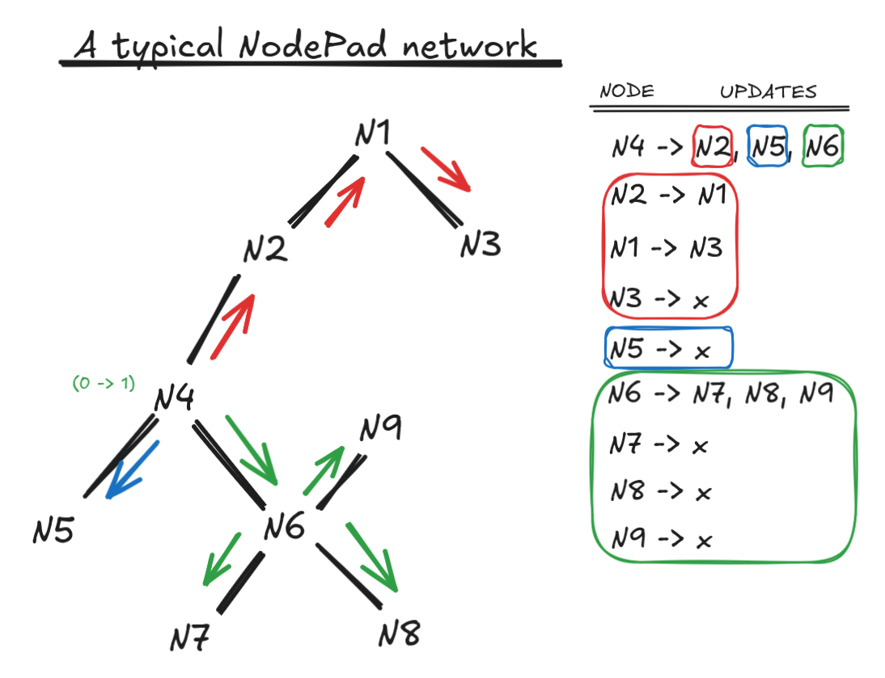

# NodePad: A Decentralized P2P Text Sync Tool

NodePad is a minimal, lightweight, **peer-to-peer text syncing tool** built from the ground up in Nim. It provides a simple text buffer that is instantly synced across all connected nodes, with no central server required.

This project is a practical exploration of distributed systems principles, built to solve a common and frustrating real-world problem.

## Core Features
- **Decentralized:** No central server, database, or internet connection required

- **Peer-to-Peer:** Nodes connect directly to each other in a **spanning tree**.

- **Lightweight & Fast:** Built in Nim for a tiny, single-binary deployment with minimal resource usage.

- **Efficient Sync:** Uses a **Last-Write-Wins (LWW)** model with versioning to sync the text state.

- **Smart Broadcasting:** Implements a **flooding** algorithm with **Split Horizon** to efficiently propagate updates and prevent **broadcast storms** (loops).

## The Problem

This project was born from a common and persistent frustration in virtualization and systems administration: **broken clipboard sync**.

If you've ever worked extensively with multiple virtual machines, remote desktops (RDP), or VNC sessions, you've almost certainly run into these issues:

    Copy-paste between your host machine and a guest VM suddenly stops working.

    Hypervisor guest tools (like VMware Tools or VirtualBox Guest Additions) fail, aren't installed, or are incompatible.

    Clipboard redirection is disabled by a security policy.

    You're on a secure, air-gapped, or complex network where cloud-based clipboards (like Google Keep or Pastebin) are not an option.

NodePad is built to be the "in-case-of-emergency" tool. It provides a reliable, **self-hosted** mechanism to **exfiltrate** and **infiltrate** text data between systems with zero hassle and full user control. No cloud, no sign-ups, just a simple binary.

# Use Cases
NodePad is a "guerilla" tool for getting text from Point A to Point B.

- **The "Virtualization Clipboard":** The primary use case. Quickly copy a complex command, API key, or config snippet from your host to a guest VM (or vice-versa) when clipboard integration fails.

- **Personal "Universal Clipboard":** Run it on your desktop and your laptop to keep a single, simple text buffer synced between them while on the same network.

- **Security/CTF Tool:** A simple, no-fuss way to move text (like user flags, reverse shell commands, or script outputs) between an attacker machine and a compromised, sandboxed VM.

- **Temporary "Digital Whiteboard":** A shared scratchpad for a small team on the same LAN to share temporary information like URLs, IP addresses, or code snippets during a meeting.

## Network algorithm used
### Span-tree over mesh
NodePad uses a **spanning tree topology** instead of a full mesh for two primary reasons: 
- efficiency
- real-world network constraints

A tree is the most minimal topology **(N−1 links)**, which allows for a efficient flooding algorithm. By using a **Split Horizon rule** (never sending an update back to the node it came from), messages are propagated to every peer exactly once, eliminating the redundant traffic and duplicate-checking required in a mesh. More importantly, this design excels in complex network environments (like multiple, isolated LANs behind NATs) where peers cannot discover or connect to each other directly, forcing them to communicate through a shared "bridge" node in this natural tree structure.

### Span-tree with split-horizon flooding


# Build & run commands:
```bash
# backend
nim c -r --hints:off --outdir:target src/nodepad_ng.nim -b:localhost:4242
# gui
nim c -r --app:gui --hints:off src/npgui.nim --outdir:target
```